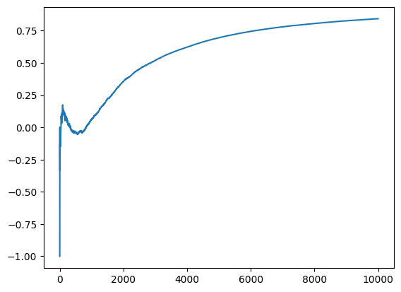
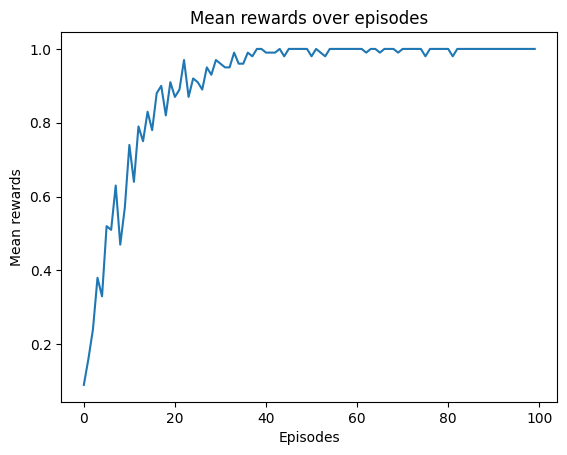
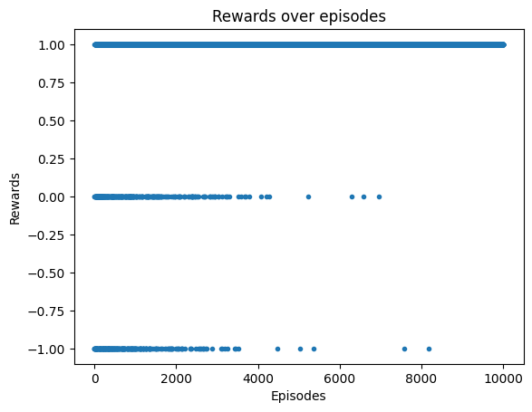
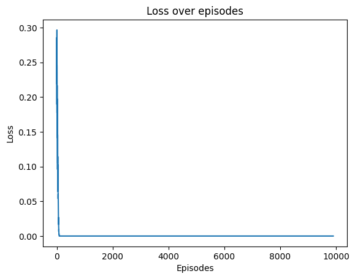
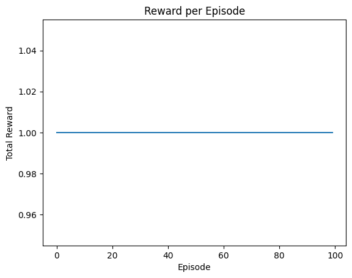

# Slot_Machine_DQN
슬롯머신 문제 - DQN 구현 

## intro
아래 문서에서는 강화인들의 코드 스니펫들이 모여 있습니다.  
💡 : **개선점이 존재**  
👍 : **멋진 구현 !**  
의 기호를 통해 코드 리뷰가 진행되어 있습니다.  

*주의사항* : 코드 발췌기준은 잘하고 말고가 아닙니다! 그냥 눈에 띄는대로 가져온거니, 코드 리뷰가 많다고 주눅드실 필요가 저언혀 없습니다! 

## Net
- Keras 계열의 코드 작성 방법  

```python
@ 지은벗
class DQN(nn.Module) :
    def __init__(self):

        super().__init__()
        self.Linear = nn.Sequential(nn.Linear(3,5), # 상태 입력
                                    nn.ReLU(),
                                    nn.Linear(5,5),
                                    nn.ReLU(),
                                    nn.Linear(5,5),
                                    nn.ReLU(),
                                    nn.Linear(5,3)) # 왼, 가, 오
    def forward(self, x):
        x = self.Linear(x)
        return x
```

💡 **naming에 주의를 기울이자!**  
self.Linear은 nn.Linear이라는 매소드가 존재하다보니 조금 헷갈릴 수 있다. 

- pytorch 계열의 코드 작성 방법  

```python
@ 주현벗
class DQN(nn.Module):
  def __init__(self, state_size, action_size):
    super().__init__()
    self.action_size = action_size
    self.state_size = state_size

    self.fc1 = nn.Linear(state_size, 30)
    self.fc2 = nn.Linear(30, 30)
    self.fc3 = nn.Linear(30, action_size)

  def forward(self, x):
    x = self.fc1(x)
    x = self.fc2(x)
    x = self.fc3(x)
    return x
```

👍 **일반화시킨 코드!** : `state_size`와 `action_size`를 파라미터로 다루기 때문에, 클래스 내부의 코드를 건들지 않더라도 쉽게 수정이 가능하다.  

## Agent 
### env-agent 의존성
```python
@ 은나벗 도희벗 짬뽕 
class DQNAgent:
    def __init__(self, state_size, action_size):
        self.state_size = state_size
        self.action_size = action_size

# 중략

lever = Lever()
agent = DQNAgent(state_size=3, action_size=3)
```

```python
@ 지민벗
class MonkeyAgent:
    def __init__(self, env):
        self.env = env
        self.n_actions = self.env.n_actions
```
💡
env와 agent는 맞물려 있다. env의 state와 action_space의 크기가 agent의 신경망의 input, output node의 수를 결정하기 때문이다. 물론 외부에서 파라미터를 받아도 되지만 그것보다는 env를 하나의 파라미터로 받고, 필요한 어트리뷰트들을 Agent class 내부에서 받는 형식이 더 낫다. 

```python
@도희벗 코드 수정
lever = Lever()
agent = DQNAgent(state_size=len(lever.state), action_size=lever.num_actions)
```

```python
@지민벗
env = LeverEnv()
agent = MonkeyAgent(env)
```

### HYPER_PARAMETERS
```python
@ 승연벗
self.discount_factor = 0.99
self.learning_rate = 0.001

self.epsilon = 1
self.epsilon_decay = 0.999
self.epsilon_min = 0.01

self.batchsize = 64 # self.batch_size = 64
```

```python
@ 지민벗
MEM_SIZE = 1000
MEM_SIZE_MIN = 100

BATCH_SIZE = 16
LEARNING_RATE = 0.001
DISCOUNT = 0.1

EPSILON = 0.9
EPSILON_MIN = 0 # 0.01
EPSILON_DECAY = 0.999

UPDATE_TARGET_EVERY = 5
```

```python
@ 정연벗
def train_model(self):
        global EPSILON
        if EPSILON > EPSILON_MIN:
            EPSILON *= EPSILON_DECAY
```
💡  
하이퍼 파라미터는 대문자로 표현하며, class 외부에서 미리 지정해두는게 일반회된 형태입니다! 전역 변수이기에 class 내부에서 사용할 수 있지만, global을 이용해 내부에서 사용하는건 지양하는게 좋습니다. 예를 들어, 엡실론의 경우, 지속적으로 감소하는 값이기 때문에 변수를 따로 지정하지 않으면 전역 변수의 값이 바뀌고, 이는 다음 실행 단계에서 오류를 발생하게 만들 수 있습니다. `__init__` 단에서 `self.epsilon`같은 어트리뷰트로 정의해주세요!  
또한 이 테스크의 경우 문제가 단순하여 많은 탐험이 필요하지 않다고 판단해 저는 EPSILON_MIN = 0으로 설정했습니다. 위 하이퍼 파라미터들은 (+lr 부분) 강화학습에 있어 핵심적인 부분들이니, 테스크에 맞는 설정이 중요합니다. 

### get_action
```python
@ 지은벗
    def get_action(self, state, idx,train=True):

        if train==False :
            with torch.no_grad():
                 q_value = self.model(torch.tensor(state, dtype=torch.float32 ))
            return torch.argmax(q_value).item()

        if train==True and np.random.rand() <= EPSILON:
            # SEARCH_IDX.append(idx)
            return (np.random.randint(0,3))

        else :
            q_value = self.model(torch.tensor(state, dtype=torch.float32 ))
            return torch.argmax(q_value).item()
```

👍 **train, test에 대해 정확히 알고 있어요!** : train에서는 탐험율을 살려주며 초기 가중치로 인한 잘못된 수렴을 막는다. 반대로 test는 학습된 모델의 성능을 확인하는 것이기 때문에 탐험율이 존재하면 안된다. 따라서 train과 test를 구분해 test에서는 random한 탐험을 없앴다.  

=> 이렇게 구현하지 않으면 train은 어떻게 구현할 수 있을까?  
A :  

💡 **idx는 행동을 결정하는데 필요한 파라미터는 아님!**

```python
@ 정연벗
    def get_action(self, state):
        if np.random.rand() <= EPSILON:
            action = np.random.choice(range(self.action_size))
        else:
            q_value = self.model(state)
            action = torch.argmax(q_value).item()

        return action
```

```python
@ 주현벗
    def get_action(self, state):
        if np.random.rand() <= self.epsilon:
          return np.random.choice(self.action_size)

      state = torch.tensor(state, dtype=torch.float32).to(self.device)
      q_values = self.model(state)
      return torch.argmax(q_values).item()
```

=> `np.random.choice` 는 파라미터로 1_dim, int 둘 다 받을 수 있다.  
참고 : https://numpy.org/doc/stable/reference/random/generated/numpy.random.choice.html

### Replay_Memory
```python
@ 지은벗
    self.memory=deque(maxlen=MEM_SIZE)

    # 중간 생략

    def append_sample(self, state,action,reward, next_state,done):
        if(len(self.memory)>MEM_SIZE):
            self.memory.pop()
        self.memory.append((state,action,reward, next_state, done))
```

💡 : queue 구조를 사용하기 때문에 pop을 해줄 필요가 없다!   

```python
@ 승연벗
def append_sample(self, state, action, reward, next_state, done):
        '''
        리플레이 메모리에 샘플 저장
        '''
        self.memory.append((state,action,reward,next_state,done))
```

👍 : 정석적인 코드 🌸   

### Sample -> Trainable Data
```python
@ 승연벗 정연벗 민서벗
# 리플레이 메모리에서 샘플 무작위 추출
minibatch = random.sample(self.memory, self.batchsize)

states = torch.tensor([sample[0][i] for sample in minibatch for i in range(3)]).reshape(self.batchsize,3)
actions = torch.tensor([sample[1] for sample in minibatch])
rewards = torch.tensor([sample[2] for sample in minibatch])
next_states = torch.tensor([sample[3][i] for sample in minibatch for i in range(3)]).reshape(self.batchsize,3)
dones = torch.tensor([sample[4] for sample in minibatch]).float()
```

list compreshension을 사용하는건 일반적인 for문을 사용하는 것보다는 속도가 빠르다! 하지만 더 빠른 방법이 존재한다. 

```python
@ 주현벗
batch = random.sample(self.memory, BATCH_SIZE)
states, actions, rewards, next_states, dones = zip(*batch)  # 메모리에서 불러옴

states = torch.tensor(states, dtype=torch.float32).to(self.device)
actions = torch.tensor(actions, dtype=torch.long).to(self.device)
rewards = torch.tensor(rewards, dtype=torch.float32).to(self.device)
next_states = torch.tensor(next_states, dtype=torch.float32).to(self.device)
dones = torch.tensor(dones, dtype=torch.float32).to(self.device)
```

👍 : `zip` 함수는 속도개선에 매우 매우 좋은 함수! 🌸   


### Train
- scalar type 
```python
@ 지은벗
# 현재 상태에 대한 모델의 큐함수
predicts = self.model(states)
one_hot_action= F.one_hot(actions, num_classes=3)
predicts = torch.sum(one_hot_action*predicts, axis=1)

# 다음 상태에 대한 타킷 모델의 큐함수
target_predicts=self.target_model(next_states)

# 벨만 최적 방정식을 이용한 타깃 업데이트
max_q, _=torch.max(target_predicts, dim=-1)
targets = rewards + (~dones) * GAMMA * max_q
```

👍 : `~dones` 간지나요!, 레퍼런스 코드를 정확히 잘 갖고온 코드!!  

💡 : `self.target_model(next_states)`가 학습대상이면 안된다!! 지금 코드는 `self.target_model.eval()`이나 `with torch.no_grad():`가 사용되지 않았기 때문에 target 값도 grad 변환의 대상이다. 이 두 코드를 추가해 target_model에 대한 역전파를 막아야 한다.  

👇👇 **역전파 대상인지 확인하는 방법**  
```python
@ 지민벗
print(target.requires_grad) # False
print(pred.requires_grad) # True
```
-> if 두 개 다 False라면, 오류 발생  

```python
@ 지민벗 민서벗
[RuntimeError]: element 0 of tensors does not require grad and does not have a grad_fn
```

```python
@승연벗 정연벗
# state를 통해 예측한 Q-value
        pred = self.model(states)

        # next state를 통해 계산한 최대 Q-value
        target_pred = self.target_model(next_states).max(1)[0].detach()

        # 벨만 최적 방정식을 통한 업데이트 타깃
        targets = rewards+(1-dones)*self.discount_factor*target_pred
        loss = self.loss(pred.gather(1, actions.unsqueeze(1)), targets.unsqueeze(1))
```
👍 : `detach`로 떼어서 target value가 학습대상이 되지 않도록 했다! 다만 가독성을 위해 loss_fn 안에는 차원처리 및 변환을 끝낸 pred, trg 값 만을 넣는 것이 좋다. 또한 타겟이 되는 신경망은 학습 대상이 아님을 명확히 보이기 위해 위와 같은 코드를 추가하는 것을 추천한다!

```python
@지민벗
pred = self.model(current_states).reshape(-1,self.env.n_actions)
        pred_q_values = pred.gather(1, action_batch) # action idx의 데이터만 꺼냄

        # target 값 계산 : reward + gamma * Q(s',a')
        with torch.no_grad():
            next_q_values = self.target_model(next_states).max(2).values

        target_q_values = reward_batch + (torch.ones(next_q_values.shape, device=device) - done_batch) * self.discount * next_q_values

        loss = self.loss_fn(pred_q_values, target_q_values)

        running_loss = loss.item()
        self.losses.append(round(running_loss,6))

        self.optimizer.zero_grad()
        loss.backward()
        self.optimizer.step()
```

- vector type 

```python
@ 은나벗 도희벗 
def replay(self, batch_size):
        if len(self.memory) < batch_size:
            return

        minibatch = random.sample(self.memory, batch_size)
        for state, action, reward, next_state, done in minibatch:
            target = reward
            if not done:
                target = (reward + self.gamma * torch.max(self.model(torch.FloatTensor(next_state))).item())
            target_f = self.model(torch.FloatTensor(state)).squeeze().tolist()
            if action < self.action_size:  # action이 action_size 이내에 있는지 확인
                target_f[action] = target
                self.model.zero_grad()
                loss = nn.MSELoss()(self.model(torch.FloatTensor(state)), torch.FloatTensor(target_f))
                loss.backward()
                with torch.no_grad():
                    for param in self.model.parameters():
                        param.data -= 0.001 * param.grad  # 학습률 0.001로 가중치 업데이트
        if self.epsilon > self.epsilon_min:
            self.epsilon *= self.epsilon_decay
```

💡 
1. `if action < self.action_size:  # action이 action_size 이내에 있는지 확인`  
이 코드는 env-agent 의존성을 고려해 코드를 짜면 필요하지 않은 부분이다.  
2. `loss = nn.MSELoss()(self.model(torch.FloatTensor(state)), torch.FloatTensor(target_f))` 코드 상에 틀린 내용은 없지만, 
loss 함수는 `__init__` 단에서 따로 지정해주어 분리시키는게 더 가독성이 좋은 코드다!  

👍 학습률 감소 부분 : 유일하게 구현!!!! 강화학습의 핵심적인 요소 구현을 해냈다!! 다만 감소율 또한 min, decay 하이퍼 파라미터로 빼서 생각하는 게 좋다. 

```python
@ 지민벗 
def train(self, done):
        if len(self.replay_memory) < MEM_SIZE_MIN:
            return

        batch = random.sample(self.replay_memory, BATCH_SIZE)

        # calculate new Q
        states, actions, rewards, next_states, epi_dones = zip(*batch)

        current_states = torch.tensor(states, dtype=torch.float).reshape(-1, 1, self.env.n_actions).to(device)
        next_states = torch.tensor(next_states, dtype=torch.float).reshape(-1, 1, self.env.n_actions).to(device)

        actions = torch.tensor(np.array(actions), dtype=torch.int).reshape(-1,1).to(device)
        rewards = torch.tensor(np.array(rewards), dtype=torch.float).reshape(-1,1).to(device)
        epi_dones = torch.tensor(np.array(epi_dones), dtype=torch.float).reshape(-1,1).to(device)

        self.model.train()
        self.target_model.eval()

        current_q_values = self.model(current_states).reshape(-1,self.env.n_actions)

        with torch.no_grad():
            next_q_values = self.target_model(next_states)

        target_value = rewards + (1 - epi_dones) * self.discount * torch.max(next_q_values, dim=2)[0].reshape(-1,1)

        target_q_values = copy.deepcopy(current_q_values.detach())
        target_q_values[range(BATCH_SIZE), actions] = target_value

        loss = self.loss_fn(current_q_values, target_q_values)
        running_loss = loss.item()
        self.losses.append(round(running_loss,6))

        self.optimizer.zero_grad()
        loss.backward()
        self.optimizer.step()

        if done:
            self.target_update_counter += 1

        if self.target_update_counter == UPDATE_TARGET_EVERY:
            self.target_update_counter = 0
            self.update_target_model()

        # decay epsilon
        self.epsilon = max(EPSILON_MIN, self.epsilon*EPSILON_DECAY)
```


### Update Target model
```python
@ 지은벗 승연벗
if e%100 ==0:
    agent.update_target_model()
```

```python
@지민벗
if done:
    self.target_update_counter += 1

if self.target_update_counter == UPDATE_TARGET_EVERY:
    self.target_update_counter = 0
    self.update_target_model()
```

타겟 신경망을 업데이트하는 부분은 에피소드 실행 부분에 있어도 되고, agent class 안에 있어도 된다. 
위 지은벗 승연벗의 코드가 첫 번째 케이스, 지민벗의 코드가 두 번째 케이스다. 
다만 타겟 신경망을 학습 신경망의 파라미터로 업데이트하는 것 또한 하나의 하이퍼 파라미터이기 때문에 하이퍼 파라미터로 명시해두는 것이 좋다. 

### Print 

```python
@승연벗
print(f"[episode: {epi+1}/{EPISODES}] score avg: {score_avg:.3f}, cnt: {cnt}, memory length: {len(agent.memory)}, epsilon: {agent.epsilon:.3f}")
>> [episode: 9851/10000] score avg: 0.840, cnt: 8821, memory length: 2000, epsilon: 0.010
```

```python
@민서벗
episodes.append(epi)
scores.append(score)
scores_avg.append(np.mean(scores))

if (epi % 50 == 0):
    print(f"episode: {epi} | lever right:{cnt} | score: {np.mean(scores):.3f}")

>> Episode: episode: 10000 | lever right:9314 | score: 0.896
```
💡 초반 에피소드는 학습이 되지 않은 자료이기 때문에, 초반 에피소드의 결과까지 전부 다 포함해 현재 학습을 보는거는 효과적이지 않다. 
`print_interval`을 정해 특정 구간에서의 결과의 평균을 보는게 현재 모델 성능을 알아보는데 적합하다.  

## Visualization
- @승연벗 : 50 interval 간의 평균 scores
  

- @지민벗  
1. Mean rewards per 100 epi  

2. Mean Rewards per 100 epi  

3. Loss  


## Tester

```python
@지은벗
# 학습된 모델을 테스트
print("---Test---")
state = env.reset()
print("initial state : ", state)
done = False
while not done:
    action = agent.get_action(state,False)
    next_state, reward, done = env.step(action)
    print("Action:", action)
    print("Next State:", next_state)
    print("Reward:", reward)
    state = next_state

>> ---Test---
>> initial state :  [0, 0, 0]
>> Action: 2
>> Next State: [0, 0, 1]
>> Reward: 1
```
- 단일 에피소드 검정 코드

```python
@주현벗
# Test
def test_model(model_path, env, agent, num_episodes=100):
    # 저장된 모델을 로드
    agent.model.load_state_dict(torch.load(model_path))
    agent.model.eval()  # 모델을 평가 모드로
    agent.epsilon = 0 # 평가모드에서 epsilon = 0 설정

    # 에피소드별 점수를 저장할 리스트를 초기화
    episode_rewards = []

    # 테스트를 위한 루프를 실행
    for episode in range(1, num_episodes + 1):
        state = env.reset()
        done = False
        total_reward = 0

        while not done:
            action = agent.get_action(state)
            next_state, reward, done = env.step(action)

            state = next_state
            total_reward += reward

        # 에피소드별 점수 기록
        episode_rewards.append(total_reward)

    # 결과를 출력
    avg_reward = sum(episode_rewards) / num_episodes
    print(f"Avg. Reward over {num_episodes} rewards: {avg_reward}")

    # 학습 진행 상황을 그래프로 시각화
    plt.plot(episode_rewards)
    plt.xlabel('Episode')
    plt.ylabel('Total Reward')
    plt.title('Reward per Episode')
    plt.show()

# 모델 경로와 테스트할 환경을 설정
model_path = 'trained_model.pth'
env = Environment()
agent = MonkeyAgent(len(env.observation_space), len(env.action_space))

# 모델을 사용하여 테스트
test_model(model_path, env, agent)
```
- 여러 에피소드에 대한 Test  


